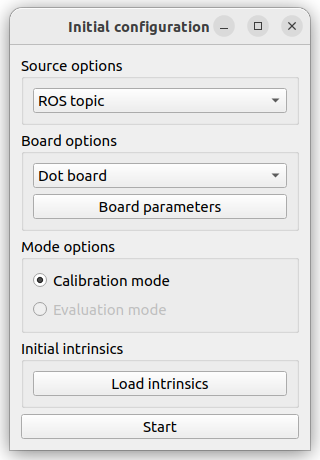
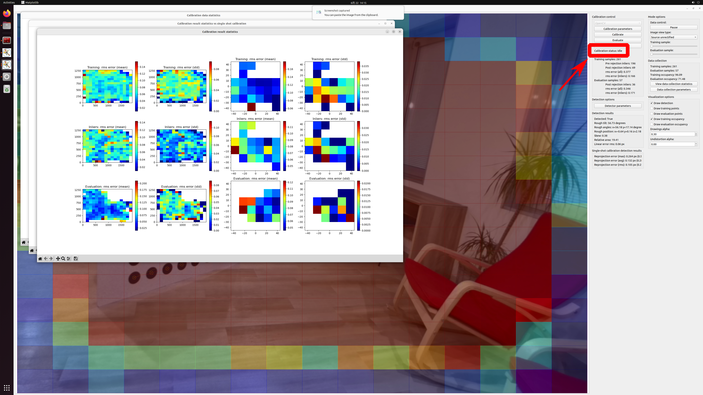

# 3. Sensor Calibration

Estimate your intrinsic/extrinsic parameters on your sensor system using [tier4/calibration_tools](https://github.com/tier4/CalibrationTools).

**NOTE: Perform the following tasks on the x86-based ECU**.

## 3-1. Calculate intrinsic parameters for cameras

Before starting intrinsic parameters estimation, start camera streaming:
```sh
# optional: access Jetson-based ECU remotely
ssh <IP_address(default: 192.168.2.2)> -l <username>

# start camera streaming
cd edge-auto-jetson
source install/setup.bash

ros2 launch edge_auto_jetson_launch edge_auto_jetson.launch.xml perception:=false
```

Then, launch `calibration_intrinsic` to estimate your intrinsic parameters of your cameras.
See [this document](https://github.com/tier4/CalibrationTools/blob/tier4/universe/sensor/docs/how_to_intrinsic_camera.md) for detailed operation on the tool.


```sh
cd edge-auto
source install/setup.bash

ros2 launch edge_auto_launch calibration_intrinsic_sample.launch.xml
```

On the first popup window, select `ROS topic` to perform calibration on live streaming camera data
(In the case of using recorded data in ROSBAG, select `ROS bag`).
Afterwards, select the appropriate board options and board parameters,  then click `Start`:



On the second popup window, select the topic name of the camera you would like to perform intrinsics calibration.
This tool can accept `compressed` topic as the target topic, and the compressed data would be preferred to save
the network load of the system.
Note that each topic on ROS 2 has its quality of service (QoS).
If the actual QoS assigned by a publisher and  QoS(s) expected by subscribers are not acceptable combinations,
the communication between them will not be issued properly. By default, edge-auto-jetson publishes
sensor data with `BEST_EFFORT` QoS reliability, so here choose it on the drop down list.


After data collection, click `calibrate` and wait until "Calibration status" turns into `idle`.
If intrinsic parameters are estimated correctly, the reports of the estimation are displayed on
some additional popup windows:



Repeat this step for all cameras in your system.

Intrinsic parameters for all cameras consisting of your system (e.g., `camera0` and `camera1` in this tutorial)
should be stored on `individual_params`.
After acquiring the files, put them in appropriate folder on your **Jetson-based ECU** so that they are loaded and published as `camera_info` topics:

```sh
edge-auto-jetson/src/individual_params/individual_params/config/
└── default # <- this will be an identifier, which refered to as the value of `VEHICLE_ID` environment variable, of your system
    ├── camera0
    │   ├── camera_info.yaml  # <- replace this file with your calculated results
    │   ├── trigger.param.yaml
    │   └── v4l2_camera.param.yaml
    ├── camera1
    │   ├── camera_info.yaml  # <- replace this file with your calculated results
    │   ├── trigger.param.yaml
    │   └── v4l2_camera.param.yaml

```


## 3-2. (Optional) Get a correction file from LiDAR

Some product series of LiDARs, including HESAI AT128, have the capability to access their own correction file stored inside them.
To get better results, you are encouraged to download the correction file from individual LiDAR, and store it in appropriate folder on the x86-based ECU:

```sh
edge-auto/src/individual_params/individual_params/config/
└── default
    └── lidar
        └── at128_default.dat # <- replace this file with your downloaded dat file
```

## 3-3. Calculate extrinsic parameters between LiDAR and cameras

Finally, launch `calibration_extrinsic` that matches your LiDAR setup to estimate your extrinsic parameters between your lidar and cameras.
See [this document](https://github.com/tier4/CalibrationTools/blob/tier4/universe/sensor/docs/how_to_extrinsic_interactive.md)
for detailed operation on the tool.

```sh
cd edge-auto
source install/setup.bash

ros2 launch edge_auto_launch calibration_extrinsic_at128_sample.launch.xml
## or
ros2 launch edge_auto_launch calibration_extrinsic_xt32_sample.launch.xml
```

To perform sensor fusion, pose relationships (i.e., extrinsic parameters) between all fused sensors need to be registered in `TF`, which is the ROS-fashion to represent the relationships.

NOTE: In these sample, there is the assumption that all sensors are fixed and their relative positions do not change.

After calculating extrinsic parameters, put the result in the appropriate files on the x86-based ECU:

```sh
edge-auto/src/individual_params/individual_params/config/
└── default
    ├── at128_to_camera0.json # <- replace this file with your calculated results
    └── at128_to_camera1.json # <- replace this file with your calculated results
```
